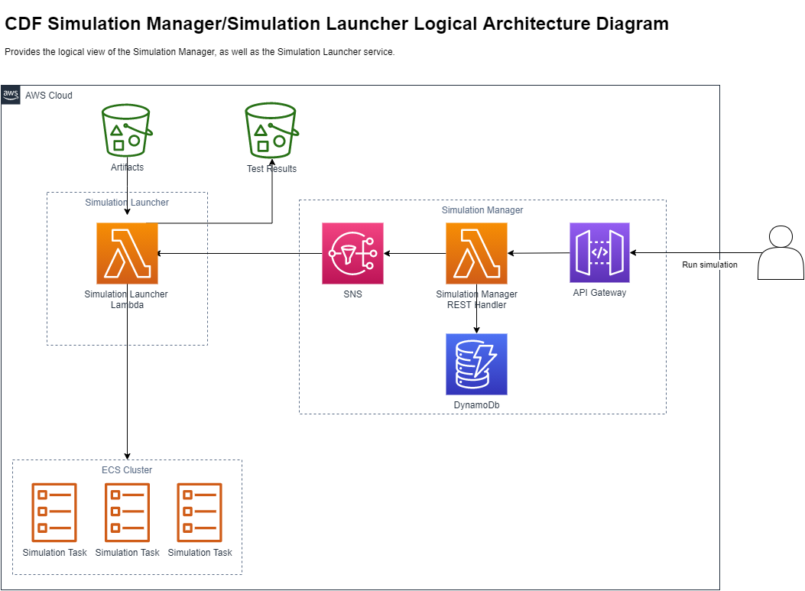

# CDF SIMULATION MANAGER OVERVIEW

# Introduction

The _Simulation Manager_ module, along with the [_Simulation Launcher_](../simulation-launcher/README.md) module, together form the _CDF Fleet Simulator_ module.

It is responsible for the management of fleet simulations.

## Architecture

The following represents the architecture of the Simulation Manager module along with its mandatory sibling [Simulation Launcher](../simulation-launcher/README.md) module.

Simulation Manager provides a set of API's that can be used to create and manage Fleet simulations.

The incoming simulation events are routed to the [Simulation Launcher](../simulation-launcher/README.md) that provisions and manages the ECS Fargate Cluster that runs the test plans which may include device simulations.

Each ECS Fargate task uses its configuration to pull the relevant test plan and artifacts from the configured S3 bucket. Jmeter is used to execute the test plans on each Fargate instance, and uploads the simulation results once complete.

## Key Concepts

### Simulation

A `Simulation` manages how we run and orchestrate test plans. A Simulation can be composed of multiple modules and tasks that will be run in tandem to simulate a fleet of devices.

### Module

A `Module` represents an application that is executed by the simulation test plan. Examples include applications for generating realistic device metadata, or a device simualtor.

### Task

A `Task` represents the executional section of the simulation. Based on the configaration of the task multiple ECS instances can be spun up to run the simulation in parallel. During the execution of a task an instance is spun up from the simulation ECS image. This instance will use jmeter to execute the provided test plan

## Useful Links

- [Application configuration](docs/configuration.md)
- [Swagger](docs/swagger.yml)
